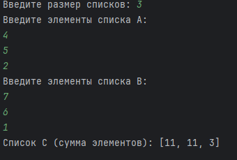
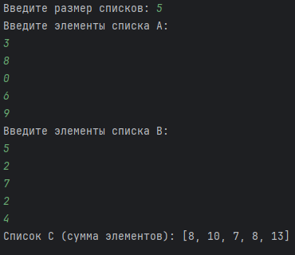
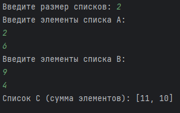

# Практическая работа №3 #  

### Тема: работа со списками ###

### Цель: получить навыки работы со списками ###

#### Ход работы ####

##### Задача: #####

> Даны списки A и B размера N. Создать новый список C элементы которого это сумма элементов одного индекса списков A и B. 

##### Контрольный пример: #####

> Ввожу размер списка 3, потом ввожу элемент списка A: 4 5 2 и списка B: 7 6 1 получаю 11,11,3 
> Ввожу размер списка 5, потом ввожу элемент списка A: 3 8 0 6 9 и списка B: 5 2 7 2 4 получаю 8, 10, 7, 8, 13     
> Ввожу размер списка 2, потом ввожу элемент списка A: 2 6 и списка B: 9 4 получаю 11,10  


##### Системный анализ: #####

> Входные данные: 'int N,A,B'  
> Выходные данные: 'int C'

##### Блок схема: #####


##### Код программы: #####

```python
N = int(input("Введите размер списков: "))

A = []
print("Введите элементы списка A: ")
for i in range(N):
    e = int(input())
    A.append(e)

B = []
print("Введите элементы списка B: ")
for i in range(N):
    e = int(input())
    B.append(e)

C = []
for i in range(N):
    C.append(A[i] + B[i])

print("Список C (сумма элементов):", C)

```

##### Результат работы программы: #####

* Вводим размер списка 3, потом вводим элемент списка A: `4` `5` `2` и списка B: `7` `6` `1`   

* Вводим размер списка 5, потом вводим элемент списка A: `3` `8` `0` `6` `9` и списка B: `5` `2` `7` `2` `4`   

* Вводим размер списка 2, потом вводим элемент списка A: `2` `6` и списка B: `9` `4`   


##### Выыод по проделанной работе: #####  

> Я молодец :) Я справился с этой работой